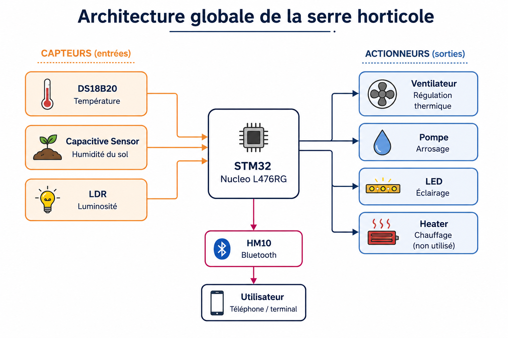
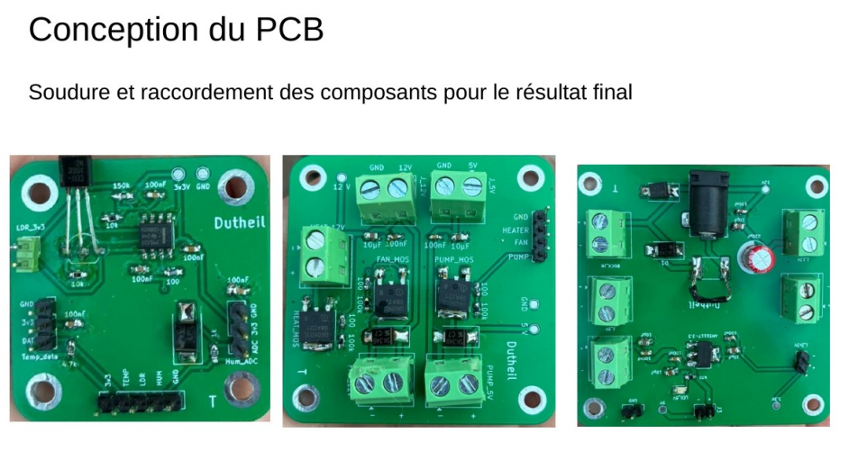

# 🌱 Smart Greenhouse Controller

<p align="center">
  
  
  
  
  
  
  
</p>

---

## 📖 Overview

This project is a **smart greenhouse controller** designed around an **STM32L476RG** microcontroller.  
The goal was to create an embedded system capable of:

- 🌡 Monitoring temperature
- 💧 Monitoring soil humidity
- ☀️ Measuring ambient light
- 🚿 Controlling a water pump
- 🌬 Controlling a cooling fan
- 💡 Controlling LED lighting using PWM
- 📱 Communicating wirelessly through Bluetooth

The project combines:

- Embedded programming
- Power electronics
- PCB design
- Sensor acquisition
- Bluetooth communication
- PWM control
- Rapid prototyping

---

# 🧠 System Architecture

<p align="center">
  
</p>

The system is divided into several functional blocks:

- 🔋 Power PCB
- ⚡ Actuator PCB
- 🌱 Sensor PCB
- 💡 LED Control PCB
- 🧠 STM32 Main Controller

---

# 🔌 Hardware Used

## 🧠 Microcontroller

| Component | Description |
|---|---|
| STM32L476RG | Main embedded controller |

---

## 🌱 Sensors

| Sensor | Purpose |
|---|---|
| DS18B20 | Temperature measurement |
| Capacitive Soil Sensor V2.0 | Soil humidity measurement |
| LDR | Ambient light measurement |

---

## ⚡ Actuators

| Component | Purpose |
|---|---|
| 5V Water Pump | Irrigation |
| 12V Fan | Cooling |
| 12V LED Modules | Artificial lighting |

---

# 📡 Bluetooth Communication

The system communicates with a smartphone using a **HM10 BLE module**.

Commands can be sent directly from a mobile device:

```txt
PUMP_ON
PUMP_OFF
FAN_ON
FAN_OFF
TEMP?
HUM?
LIGHT?
LED:500
```

The STM32 then responds with sensor values or activates the requested actuator.

---

# 💡 PWM LED Control

LED brightness is controlled using PWM generated by **TIM3**.

```txt
LED:0      -> OFF
LED:250    -> 25%
LED:500    -> 50%
LED:999    -> 100%
```

---

# 🛠 PCB Design

The project originally started as a single large shield PCB.

To improve modularity and debugging, the system was redesigned into multiple smaller PCBs:

- Power PCB
- Sensor PCB
- Actuator PCB
- LED PCB

This modular architecture made:
- testing easier,
- debugging faster,
- integration cleaner.

<p align="center">
  
</p>

---

# 💻 Software

The firmware was developed using:

<p align="left">
  
  
  
  
</p>

Main software features:

- UART communication
- ADC acquisition
- PWM generation
- Threshold-based alerts
- Sensor data processing
- Bluetooth command parsing

---

# 📱 Android Application

An Android application was also started using:

<p align="left">
  
  
</p>

The goal was to create a dedicated greenhouse monitoring interface.

---

# 🧪 Testing

Each subsystem was validated independently:

- ✅ Pump control
- ✅ Fan control
- ✅ Bluetooth communication
- ✅ PWM LED control
- ✅ Temperature acquisition
- ✅ ADC acquisition
- ✅ Sensor threshold detection

The project was progressively integrated block-by-block during development.

---

# 🏗 Greenhouse Prototype

A physical greenhouse mockup was built to integrate the electronics into a realistic environment.

Materials used:

- Plexiglass
- Wood
- PVC bars
- Aluminum bars

<p align="center">
  
</p>


---

# 🚀 Future Improvements


- 📲 Complete Android app
- 🤖 Automatic greenhouse regulation
- 📈 Data logging

---

# 👨‍💻 Authors

- subhn-n
- Trifano


ENSEA - Embedded Systems Project 🌱

